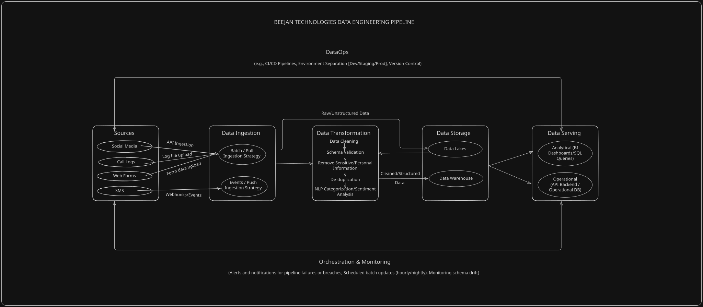

 # Beejan Technologies — Enterprise Data Pipeline Design

## Overview

This repository details a conceptual, end-to-end data pipeline designed to ingest, process, store, and serve complaint data for Beejan Technologies.

## Pipeline Diagram

### Architecture at a Glance

| Data Source | Data Format | Ingestion Strategy | Primary Destination |
| :--- | :--- | :--- | :--- |
| **SMS Complaints** | Unstructured Text | Event / Push (Webhooks) | Data Lake $\rightarrow$ Data Warehouse | 
| **Social Media** | Semi-Structured (API) | Batch / Pull | Data Lake $\rightarrow$ Data Warehouse |
| **Call Center Logs** | Unstructured Server Logs | Batch / Pull | Data Lake $\rightarrow$ Data Warehouse |
| **Web Forms** | Semi-Structured / Files | Batch / Pull | Data Lake $\rightarrow$ Data Warehouse |

---

## Design Choices
Below are a summary of my design choices and decisions:

### 1. Source Identification
The pipeline ingests four primary customer complaint channels:

- **SMS Complaints**: First-party data — short text messages paired with metadata such as timestamps and phone numbers.
- **Social Media**: Third-party data collected via external APIs, including post content, user handles, timestamps, and engagement metadata.
- **Call Center Logs**: First-party data generated by call center systems — server logs, call metadata, transcripts, and audio recordings.
- **Web Forms**: First-party data from customer submissions — structured fields (complaint category, contact info) alongside unstructured description text.

These sources produce different types of data, so I account for this when deciding how to ingest and store them.

### 2. Ingestion Strategy
I chose a combination of batch/pull and event/push ingestion based on how I assume each source currently makes its data available.

- For social media, I use a **batch/pull** strategy. The pipeline periodically requests new posts or mentions through the available APIs. Batching and pulling also prevents Beejan from hitting third-party rate limits.

- For call center logs, I also use a **batch/pull** strategy. I assume that the call center system stores its logs and related files before making them available for extraction. The pipeline can therefore collect these files on a schedule rather than receiving every call record as an individual event.

- For web forms, I use a **batch/pull** strategy. Given that Beejan Technologies currently relies on manual systems and spreadsheets and has no existing data pipeline, I assume that form submissions are stored in a database or exported into files that the pipeline can collect periodically.

- For SMS complaints, I use an **event/push** strategy. I assume that the SMS gateway can immediately send incoming messages to the pipeline through a webhook.

This gives me **three** **batch/pull** sources and **one** **event/push** source, allowing me to avoid introducing real-time infrastructure where the scenario does not require it.

### 3. Data Transformation
I chose an ELT (Extract, Load, Transform) approach for this pipeline, i.e., incoming data is first loaded into the Data Lake in its raw form after which transformation can occur.

I chose the ELT strategy because Beejan Technologies receives data in different formats. Transforming all of this data before storing it could take a lot of time and require me to define a rigid structure for the data upfront. The ELT strategy preserves the original data in the Data Lake, before deciding how to transform it based on the business requirements.

Also, since the company does not currently have a centralized data pipeline, I want to prioritize collecting and preserving the available data before applying transformations to it.

The pipeline first loads the raw data into the Data Lake before applying the following transformations:

- **Data Cleaning**: Removes whitespaces, handles missing values, and reconciles inconsistent data formats.
- **Schema Validation**: Checks incoming records against the expected structure to ensure that required fields exist and contain valid data.
- **Sensitive Data Removal**: Identifies and masks sensitive personal information such as phone numbers, names, and customer identification numbers before the data moves into the curated storage layer.
- **Deduplication**: Identifies duplicate complaint records and consolidates (merge or delete a copy) them where appropriate. This is particularly important when the same complaint is submitted through multiple channels, such as SMS and a web form.
- **NLP Classification**: Applies natural language processing to unstructured complaint text to identify the nature and urgency of an interaction. The pipeline can classify records by categories such as `Billing`, `Network`, and `Service`, while also distinguishing complaints from general inquiries and identifying high-urgency issues.

### 4. Storage
Storage is a hybrid of Data Lake and Data Warehouse, matching the ELT approach: since most incoming data is unstructured or semi-structured, the data lake handles raw storage, and transformed data then moves into the warehouse for serving.

### 5. Serving
The Data Warehouse feeds structured data out to two primary consumer groups:

* **Analytics Serving (BI Dashboards & SQL Queries):** This serves business intelligence staff (i.e. data analysts, data scientists, etc.), helping them track monthly complaint trends and churn risks.

* **Operational Serving (API Backend & Real-Time Dashboards):** This serves customer support teams and other operational processes. A web frontend can retrieve processed complaint information through an API, while an operational dashboard can display complaints based on their category and urgency.

### 6. Orchestration & Monitoring

#### Pipeline Execution Cadence
Because we use a hybrid ingestion model, execution frequency varies by channel:
* **Event-Driven (Continuous):** The SMS pipeline runs continuously 24/7, triggered instantly whenever a webhook receives a message payload.
* **Batch Schedules:** 
  - **Social Media:** Runs **hourly** to pull platform API updates without breaching rate limits.
  - **Call Logs:** Runs **nightly/off-peak (or every 6 hours)** to transfer server files without competing for call-center bandwidth.
  - **Web Forms:** Runs **every 15 to 30 minutes** to query database updates for rapid ticket resolution.
* **Downstream Transformation & Warehouse Refresh:** Runs on a scheduled **hourly micro-batch cadence** to clean incoming raw data and update analytics tables.

#### Failure Detection & Automated Notifications
* **Health Checks & Monitoring:** An orchestration tool (like Apache Airflow or Prefect) tracks task states, execution latencies, and pipeline retries.
* **Alert Routing:** 
  - **Non-Critical Warnings:** Schema warnings or non-fatal API rate-limit delays post directly to a dedicated `#data-pipeline-alerts` Slack channel.
  - **Critical Failures:** Direct pipeline crashes or storage connection drops trigger automated alert pings (via PagerDuty or Opsgenie) to on-call data engineers.
* **Automated Retries & DLQ:** Intermittent network issues trigger 3 automated retry attempts before routing unprocessable payloads into a **Dead Letter Queue (DLQ)** for manual inspection.

### 6. Orchestration & Monitoring

#### Pipeline Execution
Because of the hybrid ingestion model, execution frequency varies by source:
* **Event-Driven (Continuous):** The SMS pipeline runs continuously 24/7, triggered instantly whenever a incoming webhook receives a message payload.
* **Batch Schedules:** 
  - **Social Media:** Runs **hourly** to fetch new platform API records to avoid hitting rate limits.
  - **Call Logs:** Runs **nightly or during off-peak hours** to transfer server files to avoid competing for call-center bandwidth.
  - **Web Forms:** Runs **every 15 to 30 minutes** to query database updates for prompt ticket resolution.

#### Failure Detection & Automated Notifications
* **Monitoring:** A central orchestrator is implemented to track task status, execution latency, and pipeline retries.
* **Alert Routing:** 
  - **Non-Critical Warnings:** Schema warnings or minor API rate-limit delays send automated notifications directly to, say a dedicated engineering chat channel.
  - **Critical Failures:** Direct pipeline crashes or storage connection losses trigger top-priority alerts to on-call data engineers.

### 7. DataOps & Production Deployment

The pipeline runs in a managed cloud environment for scalability and minimal physical hardware maintenance.

#### Deploying to Production (CI/CD & Environment Management)
* **Environment Isolation:** Code and infrastructure are strictly separated across three isolated environments: `Development`, `Staging`, and `Production`.
* **Automated CI/CD Pipeline:** 
  1. Developers push code updates to the repository.
  2. Automated pipeline checks execute unit tests, syntax linting, and data transformation validation against the `Development` environment.
  3. Merging changes to the main repository triggers automated integration tests in `Staging` before applying zero-downtime deployments to `Production`.

## Assumptions & Thought Process
I took the liberty of assuming a few things about the company. These assumptions include:

- **Third-party data ingestion**: I assumed that data from social media apps were ingested by consuming third-party APIs as opposed to web scraping.

- **Call Logs & Spreadsheets:** Because Beejan Technologies currently relies on manual spreadsheets and no prior data pipeline, I assumed that web form data and call logs collated in manual logs and sheets and not streamed into the pipeline. Implementing a scheduled **Batch Pull** strategy was my preferred choice to reflect this. I did so because it is cost-effective and simple to implement, avoiding overengineering at an early stage.

- **Decoupled Architecture:** I designed **DataOps** (CI/CD, environment separation, version control) and **Orchestration & Monitoring** (schema drift alerts, job scheduling) as undercurrents and as such, they are removed from the flow and depicted as continuous/iterative events.

## Challenges & Unknowns

* **Schema Validation & Deduplication:** Matching an SMS complaint to a social media post from the same customer is hard without a unified Customer ID.

* **Schema Drift in Third-Party APIs:** Social platforms frequently change their API schemas, requiring active monitoring in the Orchestration layer to prevent ingestion failures.

* **Unstructured Audio & Transcript Accuracy:** Inconsistent call recording quality can affect downstream NLP accuracy during sentiment scoring.

## Additional Notes